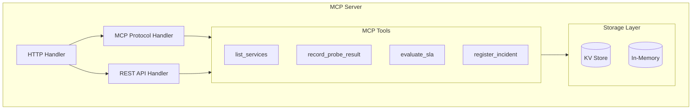
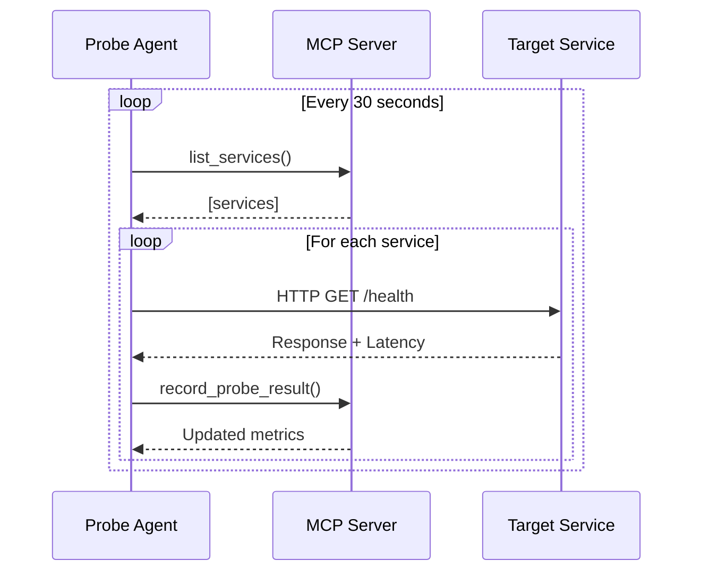
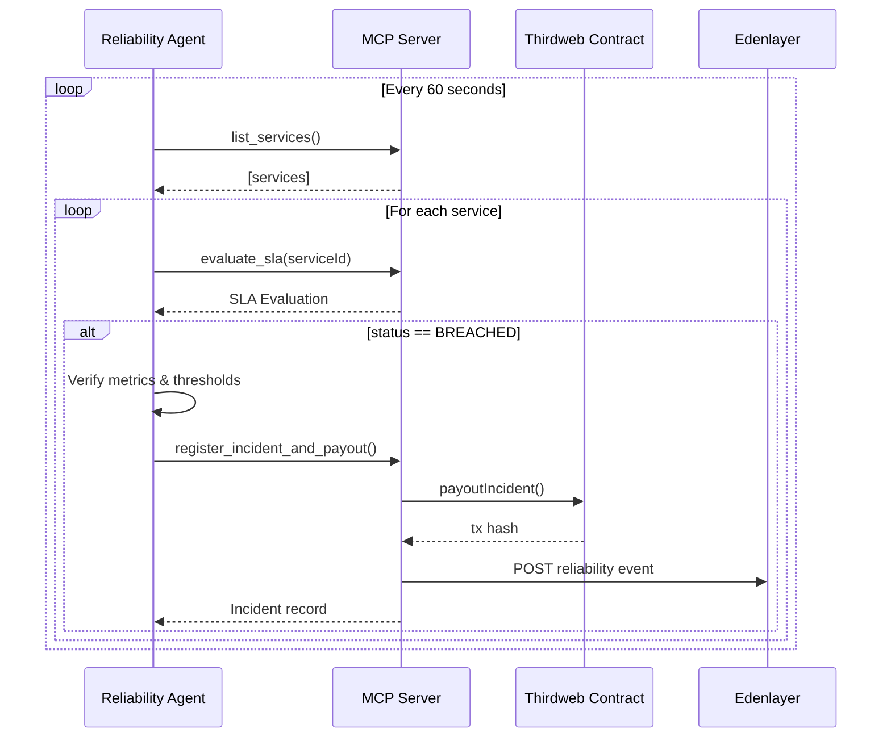
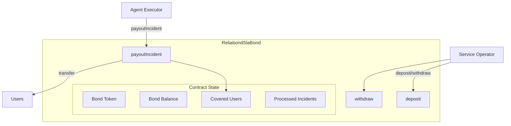
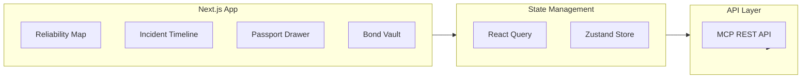
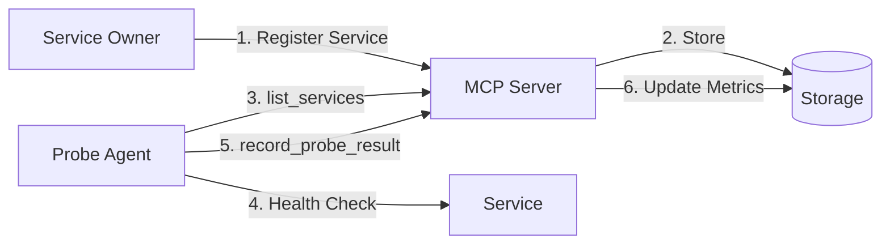
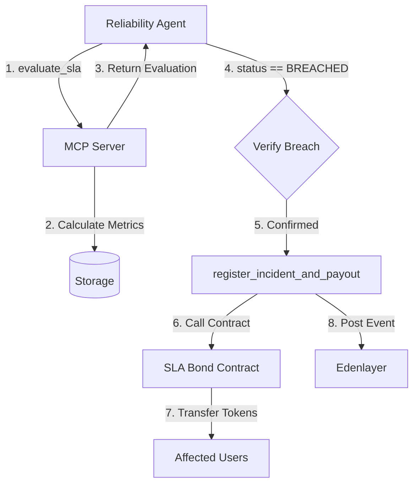

# 🏗️ Reliabond Architecture

This document details the technical architecture of Reliabond, an Agent Reliability Exchange built for Nullshot Hacks Season 0.

---

## System Overview

Reliabond consists of five main components:

1. **MCP Server** - Central coordination and data layer
2. **Probe Agents** - Health monitoring agents
3. **Reliability Agent** - SLA enforcement agent
4. **SLA Bond Contract** - On-chain bond management
5. **Web Dashboard** - Visualization and monitoring

---

## Component Architecture

### 1. MCP Server (Cloudflare Worker)

The MCP server is the central nervous system of Reliabond, deployed as a Cloudflare Worker for edge performance.



**Endpoints:**
- `POST /mcp` - MCP protocol (JSON-RPC 2.0)
- `GET /api/services` - List all services
- `GET /api/incidents` - List all incidents
- `GET /api/stats` - Network statistics
- `GET /api/health` - Health check

### 2. Probe Agent (Nullshot)

The Probe Agent performs synthetic health checks on all registered services.



**Responsibilities:**
- Discover services via MCP
- Perform HTTP health checks
- Measure latency and availability
- Report metrics honestly

### 3. Reliability Agent (Nullshot)

The Reliability Agent monitors SLOs and triggers payouts when breaches are confirmed.



**Decision Framework:**
1. Service status must be "BREACHED"
2. Breach duration must exceed threshold
3. Compensation must be within bounds (0-10%)
4. Clear reasoning must be documented

### 4. SLA Bond Contract (Solidity/Thirdweb)

The smart contract manages bond deposits and automated payouts.



**Key Functions:**
- `deposit(amount)` - Operator deposits bond
- `withdraw(amount)` - Operator withdraws bond
- `payoutIncident(incidentId, users, amount)` - Agent triggers payout
- `addCoveredUsers(users)` - Add users to coverage

**Security:**
- Only agent executor can trigger payouts
- Max payout capped at 10% per incident
- Incident IDs prevent double payouts

### 5. Web Dashboard (Next.js)

The dashboard provides real-time visualization of the reliability network.



---

## Data Flow

### Service Registration & Probing



### Breach Detection & Payout



---

## Technology Mapping

### Nullshot Integration

| Component | Nullshot Usage |
|-----------|----------------|
| Probe Agent | Built with Nullshot TypeScript Agent Framework |
| Reliability Agent | Built with Nullshot TypeScript Agent Framework |
| MCP Server | Implements MCP protocol specification |
| Tool Definitions | Standard MCP tool schema |

### Thirdweb Integration

| Feature | Thirdweb Usage |
|---------|----------------|
| Contract Deployment | Thirdweb deploy CLI |
| Contract Interaction | Thirdweb SDK |
| Wallet Connection | Thirdweb React hooks |
| Chain Support | Base Sepolia testnet |

### Edenlayer Integration

| Feature | Edenlayer Usage |
|---------|-----------------|
| Event Publishing | POST reliability events |
| Agent Discovery | Query by reliability scores |
| Trust Records | Reliability Passports |

---

## Scaling Considerations

### Current (Demo)
- In-memory storage
- Single probe agent
- Single reliability agent

### Production Ready
- Cloudflare KV for persistence
- Multiple probe agents (geographic distribution)
- Reliability agent redundancy
- Rate limiting and circuit breakers
- Event sourcing for audit trail

---

## Security Model

### Agent Authorization
- Agent executor address whitelisted in contract
- Private key secured via environment variables
- Thirdweb secret key for SDK auth

### Payout Safety
- Maximum 10% payout per incident
- Incident ID prevents double payouts
- Only covered users receive payouts
- Breach must exceed threshold duration

### Data Integrity
- Probe results timestamped
- Rolling metrics prevent gaming
- Multiple probes required for breach

---

## API Reference

See the MCP server source code for detailed API documentation:

- [packages/mcp-reliabond/src/tools/](../packages/mcp-reliabond/src/tools/)

---

## Deployment

### Cloudflare Workers
```bash
cd packages/mcp-reliabond
wrangler deploy
```

### Smart Contract
```bash
cd packages/contracts
pnpm deploy:testnet
```

### Frontend
```bash
cd apps/web
pnpm build
# Deploy to Vercel/Netlify
```

---

*Architecture document for Nullshot Hacks Season 0 - Track 1a*
